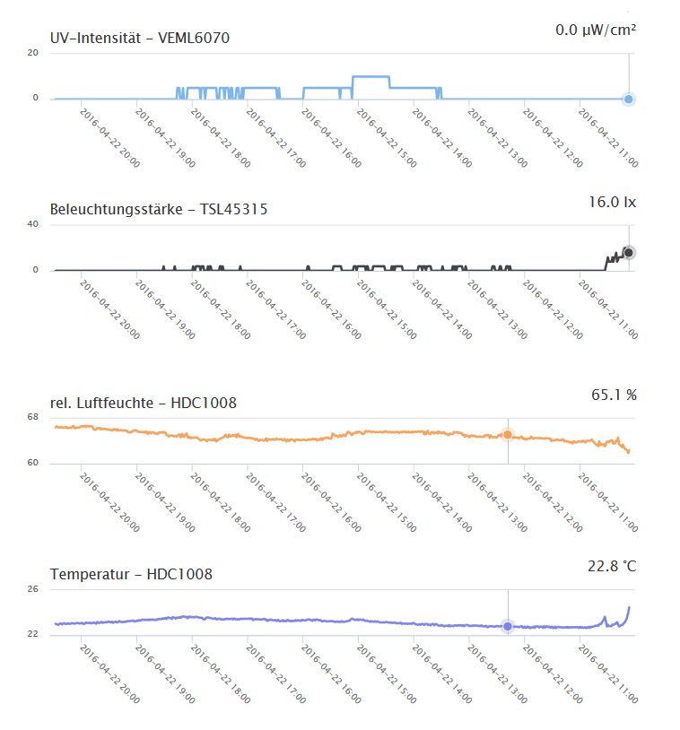

# sensebox
Die Sensebox vom Makerklub.

- Hier findest du die [Statistiken](http://rawgit.com/HPIMakerKlub/sensebox/master/statistics/sensor.html?senseBoxID=5719c4037514d05c121e317c) aus dem Ordner [`statistics`](statistics).
- Die Sensebox ist auf der Karte eingezeichnet: [OpenSenseMap](http://www.opensensemap.org/#/explore/5719c4037514d05c121e317c)

